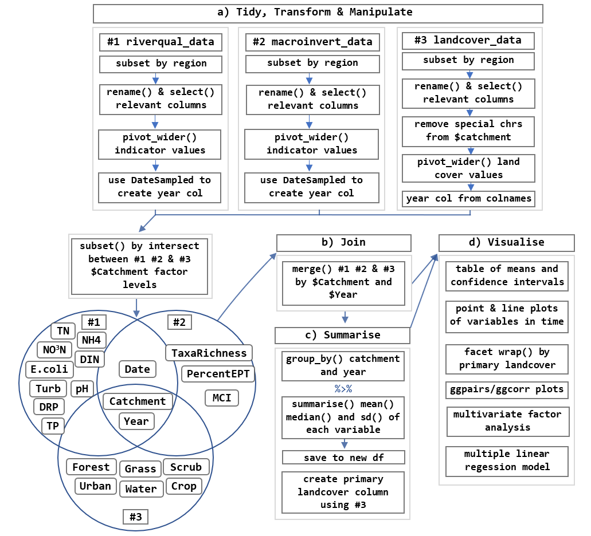

```{r setup, include = FALSE}
knitr::opts_chunk$set(message = FALSE, warning = FALSE)
require(prettydoc)
```

# A journey through time and space: Investigating river quality in the Bay of Plenty

------------------------------------------------------------------------

$~$

### Table of Contents

-   [Preface](#preface)

-   [Part I: A Brief(ish) Background](#partI)

-   [Part II: Data Wrangling](#partII)

    -   [Step a) Aligning the Datasets](#partIIa)

    -   [Step b) Matcing Catchment to Coordinates](#partIIb)

    -   [Step c) Widening and Joining the Datasets](#partIIc)

-   [Part III: Visualising Spatial Distribution of Sampling Sites](#partIII)

-   [Part IV: Visualising Temporal Trends in Quality Indicators](#partIV)

-   [Part V: Investigating Correlation Between Indicators](#partV)

-   [Part VI: Summary](#summary)

-   [References](#references)

$~$

### <a id="Preface"></a>Preface {#preface}

{width="635"}

As it often goes, this project veered from the initially-envisioned path. Planned analyses were decided against. The sequence of steps were reshuffled. An entire dataset (see Fig. 1 'landcover_data') was discarded entirely due to a lack of crossover with the remaining datasets. Previously unconsidered spatial data was included. In spite of these changes, or perhaps thanks to them, a complete reproducible workflow is presented below.

$~$

### <a id="Part I"></a>Part I: A Brief(ish) Background {#partI}

New Zealand markets a "clean green" image despite many rivers exceeding recommended limits for key contaminants.^[1,2,3](#references)^

*Why is this of concern?* Well, freshwater degradation has wide-reaching multi-trophic consequences. The heterogeneity of cobble piles and fallen fern trees provide habitat for more than 40 species of fish^[4](#references)^ and \~200 species of insect^[5,6](#references)^. Beyond that, numerous terrestrial organisms rely upon rivers for food, water and other services^[7](#references)^. Humans are not exempt either; using freshwater for drinking, hygiene, food production, cultural connection, energy generation and other economic gain^[8](#references)^. As you may expect, these values are diminished as freshwater habitats are degraded.^[8,9,10](#references)^

Intensive dairying elevates in-stream nitrogen and phosphorus levels, causing nuisance algal blooms and a suite of other biogeochemical consequences.^[2,11](#references)^ Exotic plantation forestry may not pump out so many nutrients,^[12,13](#references)^ BUT such land uses can still impede on freshwater by releasing sediments and removing those all-important vegetative sources of habitat complexity.^[14,15](#references)^ Insect abundance, taxa richness, and pollution-senstivity indicators are quickly impacted by such degradation^[16,17](#references)^ making them quite useful as indicators of ecosystem health. On the other hand (to no surprise), indigenous forest cover has been linked to reduced nutrient loads, increased biotic diversity, and habitat heterogeneity.^[18,19](#references)^

*So why investigate a topic that is so well-studied?* Despite being increasingly used as the "canaries" of freshwater, [how]{.underline} insects respond to changes in their environment is not completely understood.^[20,21,22](#references)^ We're also looking at one region in isolation which can us better understand site-specific differences and prevent "cookie cutter" approaches to management!

**In sum:**

-   Freshwater degradation is bad news for the insects, the fish, the humans, *etcetera*

-   Dairying and exotic forestry are probably largely responsible

-   We don't *entirely* understand how changes in freshwater quality impact insects

So, to investigate how indicators of freshwater quality (chemical and macroinvertebrate) vary within Bay of Plenty rivers, we drew up a few key questions;

$~$

**Quest(ion)s**

1.  How has water quality changed in Bay of Plenty rivers over the last \~10 years?

2.  How do such trends differ with catchment land cover classification?

3.  How are chemical and macroinvertebrate indicators correlated?

$~$

### <a id="Part II"></a>Part II: Data Wrangling {#partII}

```{r Data_And_Packages, message = FALSE}
## load packages - use install.packages() if not already installed
library(tidyverse) # used throughout for wrangling tidy data
library(stringi) # used to remove tuhuto from catchment names
library(lubridate) # used to format and extract DateSampled data
library(ggplot2) # used to create visually appealing plots
library(factoextra) # used in attempting principal components analysis
library(readxl) # used just below to read in catchment location xlsx file
library(reshape2) # used to produce correlation heat map 
library(ggpolypath) # used to fill geom_path of BOP boundaries on nz map
library(geojsonR) # used to read in BOP boundary data
library(gridExtra) # used to plot NZ and BOP maps side by side
library(ggrepel) # used to reduce overlap of sampling location map labels
library(patchwork) # used to plot multiple graphs in one figure
library(gglm) # used to produce linear model diagnostics
library(qwraps2) # used to produce table of summary stats
library(kableExtra) # used to format summary stats table
library(emmeans) # calc least square means on factor vars in LMM

## read data 
riverqual_orig <- read.csv("./data/lawa_riverqual_raw.csv") # from LAWA
macroinvert_orig <- read.csv("./data/lawa_macroinvert_raw.csv") # from LAWA
catchments_orig <- read_excel("./data/BOP_catchment_xy.xlsx") # from BOPRC
```

### <a id="Part II Step a"></a>Part II Step a) Aligning the datasets {#partIIa}

First up, we want filter out regions and variables not of interest to us. *Why not just leave it in? Save a step?* Filtering out irrelevant data makes datasets easier to work with. Compare the `macroinvert_orig` and `macroinvert` dataframes for example. The former has fewer rows and columns to search/scroll through. Also, applying a set of functions to 57,000 observations is going to take your computer longer than 2,100 observations!

Next step, aligning the datasets. Our macroinvertebrate monitoring and river quality datasets are akin to fraternal twins; they're produced by the same people (Land Air Water Aotearoa) and look quite similar, but differ slightly in a few important ways. In order for us to join these datasets, we need to make some changes. This means making sure each dataframe has:

-   the same number of columns,

-   with the same named headers, and

-   of the same data type

```{r Aligning_The_Datasets}
## retaining only the observations from the Bay of Plenty region as we're not interested in other regions, and so leaving them in would unnecessarily clutter our data
macroinvert <- macroinvert_orig[
  which(
    macroinvert_orig$Region =='bay of plenty'),]

riverqual <- riverqual_orig[
  which(
    riverqual_orig$Region=='bay of plenty'),] 

## using the 'stringi' package to remove special characters from catchment names in each 'catchments' category to prevent issues when comparing
macroinvert_orig$Catchment <- stri_trans_general(
  str = macroinvert_orig$Catchment, # macroinvert dataset
  id = "Latin-ASCII")

riverqual_orig$Catchment <- stri_trans_general(
  str = riverqual_orig$Catchment, # riverqual dataset
  id = "Latin-ASCII")

catchments_orig$Catchment <- stri_trans_general(
  str = catchments_orig$Catchment, # catchments dataset $Catchment
  id = "Latin-ASCII")

catchments_orig$GreaterCatchment <- stri_trans_general(
  str = catchments_orig$GreaterCatchment, # catchments dataset $GreaterCatchment
  id = "Latin-ASCII")

catchments_orig$PrimaryCatchment <- stri_trans_general(
  str = catchments_orig$PrimaryCatchment, # catchments dataset $PrimaryCatchment
  id = "Latin-ASCII")

catchments_orig$SecondaryCatchment <- stri_trans_general(
  str = catchments_orig$SecondaryCatchment, # catchments dataset $SecondaryCatchment
  id = "Latin-ASCII")

catchments_orig$TertiaryCatchment <- stri_trans_general(
  str = catchments_orig$TertiaryCatchment, # catchments dataset $TertiaryCatchment
  id = "Latin-ASCII")


## renaming the date column to match the riverqual dataset as we can only bind the rows of two datasets with the same named columns; 
## thus ensuring their names match will allow us to join (and thus more easily compare) the chemical quality and macroinvertebrate data
macroinvert <- rename(macroinvert_orig, 
                      "DateSampled" = "Date.Samples.Collected")

## retaining only the variables of interest to make the datasets clean and easier to work with
macroinvert <- macroinvert %>% 
  dplyr::select(Catchment, # catchment name: to match with lat/long in 'catchments' to enable spatial visualisation of sampling locations
                RECLandcover, # - river environment classification (REC) land cover: for understanding how indicators vary with land cover
                DateSampled, # for analysing temporal trends
                Indicator, # indicator names: to divide up the indicator values
                Value) # indicator values: to enable numeric comparisons

riverqual <- riverqual_orig %>% 
  dplyr::select(Catchment, 
                RECLandcover, 
                DateSampled, 
                Indicator, 
                Value)

catchments <- catchments_orig %>%
  dplyr::select(Catchment, # retaining all catchment categories as the catchment names in the other two datasets are spread across them
                GreaterCatchment, 
                PrimaryCatchment, 
                SecondaryCatchment, 
                TertiaryCatchment, 
                Longitude,# lat and long to enable spatial mapping of sites
                Latitude)

## comparing the structure (particularly no. of row/columns) in the original and reduced datasets to emphasise the utility of a clean dataset
str(macroinvert_orig)
str(macroinvert)
```

```{r Coercing_Variables}
## coercing character variables to factor variables to enable later grouping and summarising
riverqual$Catchment <- as.factor(riverqual$Catchment)
riverqual$RECLandcover <- as.factor(riverqual$RECLandcover)
riverqual$Indicator <- as.factor(riverqual$Indicator)
riverqual$DateSampled <- lubridate::dmy(riverqual$DateSampled) # and the date variable to date:time type so we can extract the year and summarise mean indicator values by year

macroinvert$Catchment <- as.factor(macroinvert$Catchment)
macroinvert$RECLandcover <- as.factor(macroinvert$RECLandcover)
macroinvert$Indicator <- as.factor(macroinvert$Indicator)
macroinvert$DateSampled <- lubridate::dmy(macroinvert$DateSampled)

## coercing catchment categories to factor variables to enable filtering and comparison with catchment names in the other datasets
catchments$Catchment <- as.factor(catchments$Catchment)
catchments$GreaterCatchment <- as.factor(catchments$GreaterCatchment)
catchments$PrimaryCatchment <- as.factor(catchments$PrimaryCatchment)
catchments$SecondaryCatchment <- as.factor(catchments$SecondaryCatchment)
catchments$TertiaryCatchment <- as.factor(catchments$TertiaryCatchment)
```

$~$

### <a id="Part II Step b"></a>Part II Step b) Matching Catchment to Coordinates {#partIIb}

Next up, we want to drop any observations in catchments that aren't present across both datasets. Leaving these observations in would result in more rows with missing values, which complicates analyses and often limits the functions we can perform.

But here's where it gets tricky. There are five scales of catchment in the `catchments` dataset, each in a separate column...

-   Catchment

-   GreaterCatchment

-   PrimaryCatchment

-   SecondaryCatchment and

-   TertiaryCatchment

The `riverqual` and `macroinvert` catchment names are not present in any single `catchments` column, but rather are described at different scales. Hence, we find the common catchment names between the `riverqual` and `macroinvert` `$Catchment` columns, and then compare the results with of the five `catchments` catchment levels (see Fig. 2).

{width="667"}

```{r Catchments_In_Common, warning = FALSE, message = FALSE}
## below we are creating five dataframes, each containing a vector of the catchment names found in common between riverqual, macroinvert, and each catchment column of the catchments dataframe

## macroinvert$Catchment
common_l1 <- data.frame("Catchment" = intersect(
  intersect(riverqual$Catchment,
            macroinvert$Catchment),
  catchments_orig$Catchment))

## macroinvert$GreaterCatchment
common_l2 <- data.frame("Catchment" = intersect(
  intersect(riverqual$Catchment,  
            macroinvert$Catchment),
  catchments_orig$GreaterCatchment))

## macroinvert$PrimaryCatchment
common_l3 <- data.frame("Catchment" = intersect(
  intersect(riverqual$Catchment, 
            macroinvert$Catchment),
  catchments_orig$PrimaryCatchment))

## macroinvert$SecondaryCatchment
common_l4 <- data.frame("Catchment" = intersect(
  intersect(riverqual$Catchment, 
            macroinvert$Catchment),
  catchments_orig$SecondaryCatchment))

## macroinvert$TertiaryCatchment
common_l5 <- data.frame("Catchment" = intersect(
  intersect(riverqual$Catchment, 
            macroinvert$Catchment),
  catchments_orig$TertiaryCatchment))

## creating one list of the common catchment names, so that we can compare the catchment name of each observation in our datasets against it...
common <- rbind(common_l1, common_l2, common_l3, common_l4, common_l5)

## ...and drop any observations with catchment names NOT in all three datasets to avoid unnecessary 'clutter'
## in the riverqual dataset
riverqual <- subset(riverqual, 
                    Catchment %in% common$Catchment) %>%
  drop_na() # to prevent issues when working with observations with missing values

## and in the macroinvert dataset
macroinvert <- subset(macroinvert, 
                      Catchment %in% common$Catchment) %>%
  drop_na() 

## and in the catchments dataset
catchments <- subset(catchments, 
                     Catchment %in% common$Catchment | GreaterCatchment %in% common$Catchment | PrimaryCatchment %in% common$Catchment | SecondaryCatchment %in% common$Catchment | TertiaryCatchment %in% common$Catchment) %>%
  droplevels()

catchments <- subset(catchments, 
                     Catchment %in% common$Catchment | GreaterCatchment %in% common$Catchment | PrimaryCatchment %in% common$Catchment | SecondaryCatchment %in% common$Catchment | TertiaryCatchment %in% common$Catchment) %>%
  droplevels()
```

From here, we can match the common catchment names to their latitude and longitude coordinates. But first, we have to divide the filtered names and corresponding lat/long values by category, and rename the name column to Catchment. *Why?*

To join the common names and the coordinates, the catchment name columns in both data frames must be of the same name. In line with tidy data principles, we can't have four `Catchment` columns in one data frame. And so, we divide them.

```{r Matching_Common_Catchments_and_Coords}
## dividing the common catchment names and corresponding coordinates by catchment class/category
## matching the catchment name colname in the common_l1 data frame to enable join
Catchment <- data.frame("Catchment" = catchments$Catchment, 
                        "Latitude" = catchments$Latitude,
                        "Longitude" = catchments$Longitude) 

## matching the catchment name colname in the common_l2 data frame to enable join
GreaterCatchment <- data.frame("Catchment" = catchments$GreaterCatchment, 
                        "Latitude" = catchments$Latitude,
                        "Longitude" = catchments$Longitude)

## matching the catchment name colname in the common_l3 data frame to enable join
PrimaryCatchment <- data.frame("Catchment" = catchments$PrimaryCatchment, 
                        "Latitude" = catchments$Latitude,
                        "Longitude" = catchments$Longitude)

## matching the catchment name colname in the common_l4 data frame to enable join
SecondaryCatchment <- data.frame("Catchment" = catchments$SecondaryCatchment, 
                        "Latitude" = catchments$Latitude,
                        "Longitude" = catchments$Longitude) 

## matching the catchment name colname in the common_l5 data frame to enable join
TertiaryCatchment <- data.frame("Catchment" = catchments$TertiaryCatchment, 
                        "Latitude" = catchments$Latitude,
                        "Longitude" = catchments$Longitude) 

## joining the common catchment names (common_lx) with the coordinates for each category/class of catchment name present in the catchments_orig dataset
c1 <- left_join(common_l1, Catchment, by = "Catchment")
c2 <- left_join(common_l2, GreaterCatchment, by = "Catchment")
c3 <- left_join(common_l3, PrimaryCatchment, by = "Catchment")
c4 <- left_join(common_l4, SecondaryCatchment, by = "Catchment")
c5 <- left_join(common_l5, TertiaryCatchment, by = "Catchment")

## merging the common names and lat/long coordinates for all catchment categories/classes to enable later joining with the catchments present in riverqual/macroinvert datasets and subsequent spatial mapping
common_xy <- rbind(c1, c2, c3, c4, c5) 
```

```{r Tidying_The_Environment, echo = FALSE, warning = FALSE, message = FALSE}
## removing unnecessary intermediate objects from environment to keep it tidy
rm(c1, c2, c3, c4, c5, common_l1, common_l2, common_l3, common_l4, common_l5, Catchment, GreaterCatchment, PrimaryCatchment, SecondaryCatchment, TertiaryCatchment)
```

$~$

### <a id="Part II Step c"></a>Part II Step c) Widening & Joining the Datasets {#partIIc}

We can then change the format of the data from wide to long so that we can reference each indicator independently.

At the same time, we will extract the year from `DateSampled` into it's own column so that we may view the mean indicator values for each year. This serves another use: reducing the number of NAs in our data frame. As most indicators aren't collected daily, comparing them in this format is more difficult.

Next up, we can drop a few potentially redundant variables. A quick look through our `riverqual` data shows that total phosphorus (TP) is usually equal to dissolved reactive phosphorus (TP). And because DRP gives us more information about the nutrients accessible to plants and algae, we can drop TP. Same deal with total organic nitrogen (TON) and total nitrogen (TN). BDISC is just another way of measuring turbidity (TURB), so we can also drop BDISC in favour of TURB. Ammonium (NH4) concentrations are consistently low across our catchments, and so keeping it doesn't provide much information.

In the `macroinvert` data, proportion of pollution-sensitive Ephemeroptera, Plecoptera and Trichoptera (EPT) provides similar information to macroinvertebrate community index (MCI), as both attribute value to ecosystems where more sensitive species are present^[23](#references)^ and so we can drop it without losing critical information.

Now that our datasets are cleaned and aligned (column-wise), we can join them by row.

```{r Widening_Cleaned_Datasets}
riverqual <- riverqual %>%
  mutate(Year = lubridate::year(DateSampled)) %>% # creating year column
  group_by(Catchment, RECLandcover, Year, Indicator) %>% # calculating mean yearly indicator values for catchment:landcover:year combinations
  summarise(Value = round(mean(Value), digits = 2)) %>%
  ungroup %>% # to avoid future issues using grouped data
  pivot_wider(names_from = "Indicator", # separating values into cols by indicator
              values_from = "Value") %>% 
  dplyr::select(-c(TP, BDISC, TON, NH4)) # losing unwanted variables (as discussed above)

## the above repeated for the macroinvert data
macroinvert <- macroinvert %>%
  mutate(Year = lubridate::year(DateSampled)) %>%
  group_by(Catchment, RECLandcover, Year, Indicator) %>%
  summarise(Value = round(mean(Value), digits = 2)) %>%
  ungroup %>%
  pivot_wider(values_from = "Value",
              names_from = "Indicator") %>%
  dplyr::select(-c(QMCI, PercentageEPTTaxa))
```

```{r Joining_Cleaned_Datasets}
## join the cleaned datasets by catchment, landcover and year retaining all rows from both to minimise loss of data/information
rivers <- full_join(riverqual, 
                    macroinvert, 
                    by = c("Catchment", 
                           "RECLandcover",
                           "Year"))
```

Finally, we can drop the rows with missing values to ensure that we're able to compare every indicator across each combination of catchment and year.

```{r Dropping_Missing_Values, warning = FALSE, message = FALSE}
## dropping the missing values to clean the dataset and allow for more comprehensive comparison
rivers_nafree <- rivers %>%
  drop_na() 
```

$~$

### <a id="Part III"></a>Part III: Visualising the Spatial Distribution of Sampling Sites {#partIII}

Let's take a look at where our data has come from, spatially.

Recall that we [previously](#partII) created a `common_xy` data frame of catchment names in common between our three datasets and their corresponding latitude and longitude coordinates. We can now join this to our `rivers` (combined `riverqual` & `macroinvert` data) data frame to map sampling locations.

```{r Sampling_Sites, fig.height = 10, fig.width = 10}
## matching lat/long coordinates to catchment names to enable mapping of sampling locations
rivers_xy <- left_join(rivers_nafree,
                       common_xy,
                       by = "Catchment") %>%
  ## coercing lat/long from character type to numeric so that we can plot them along the axes in a sensible way
  mutate(Longitude = as.numeric(Longitude),
         Latitude = as.numeric(Latitude))

## taking the middle coordinates for each catchment so that we may plot catchment labels roughly in the middle of the various sampling locations within each catchment
catchments_xy <- common_xy %>% 
  group_by(Catchment) %>%
  summarise(Longitude = median(as.numeric(Longitude)),
            Latitude = median(as.numeric((Latitude)))) %>%
  ungroup() 

## load in a geographical dataset of the Bay of Plenty (BOP) boundary using the 'geoJsonR' package
## sourced from BOPRC (see .README file in zip folder)
BOP_bound_geojson = FROM_GeoJson(url_file_string = "./data/BOP_boundary.geojson")

## extract only the spatial data (list of coordinates) that we can use to create our base map
BOP_bound <- data.frame(BOP_bound_geojson$features[[1]]$geometry$coordinates[[1]]) %>%
  rename("Longitude" = X1,
         "Latitude" = X2)

## produce a seperate map of New Zealand with the BOP area coloured in for plotting beside the BOP map (for the purpose of geographical reference)
NZ_map <- map_data("nz") 
NZ_map <- ggplot(NZ_map) + 
  geom_path(aes(x = long, 
                y = lat, 
                group = group)) + # don't connect the Nth/Sth Island paths
  geom_polypath(data = BOP_bound, # using package 'ggpolypath' to colour fill the BOP area for ease of visual recognition
            aes(x = Longitude, 
                y = Latitude), 
            colour = "firebrick",
            fill = "firebrick") +
  theme_minimal() +
  labs(x = "", y = "")

## map the Bay of Plenty sampling sites in the 'rivers' dataset
BOP_map <- ggplot(BOP_bound) +
  geom_path(aes(x = Longitude, # plot BOP boundary base
                y = Latitude),
            colour = "darkgrey") + # make the boundary lighter to improve readability of overlapping catchment labels
  geom_point(data = rivers_xy,  # plot sampling locations
             aes(x = Longitude, 
                 y = Latitude,
                 colour = MCI), # visualise how macroinvert communities differ in space
             alpha = 0.7, # using transparency for visualisation of clustered observations
             size = 3) +
  geom_text_repel(data = catchments_xy,
                  aes(x = Longitude,
                      y = Latitude,
                      label = Catchment),
                  max.overlaps = 20) +
  scale_colour_continuous(low = "#756bb1", # using contrasting colours to increase ability to visually differentiate between low and high MCI sites
                          high = "#fec44f") +
  coord_map() + # project spherical NZ map onto 2D plane
  theme_bw() +
  theme(plot.caption = 
          element_text(hjust = 0.5, 
                       margin = margin(b = 4))) + # centers/pads caption
  labs(x = "Longitude", 
       y = "Latitude", 
       title = "Bay of Plenty, NZ",
       caption = str_wrap("\nFigure 3. Map of selected sample sites from LAWA macroinvertebrate 
                          and river quality monitoring datasets across the Bay of Plenty, New Zealand. 
                          Coloured by macroinvertebrate community index (MCI)."))  

## arrange the NZ reference map (small) and the sampling site BOP map (large) 
## on the same plane using the package 'gridExtra'
grid.arrange(NZ_map, BOP_map,
  widths = c(2, 8), # make the reference map small and informative map large
  heights = c(2.5, 8),
  layout_matrix = rbind(c(1, 2),
                        c(NA, 2))
  )
```

*The results?*

-   There is a greater concentration of sampling sites in the North-East Bay of Plenty

-   Sampling sites within the Otara and Waipapa catchments had mean MCI scores \>125 indicating excellent macroinvertebrate community 'health'^[23](#references)^

-   Sampling sites within the Whakatane and Kopurererua catchments had mean MCI scores of \~80 or less, indicating 'poor health'

-   Most sites (i.e., Kaituna, tarawera, Rangitaiki, Waitao, Waipapa, Wairoa) were somewhere in between (80-125 MCI)

-   Six sites were plotted outside of the loaded Bay of Plenty boundary, perhaps due to error in taking lat/long coordinates or describing the region, or perhaps the plotted BOP boundary is slightly incorrect

$~$

### <a id="Part IV"></a>Part IV: Summary Statistics {#partIV}

Below we produce a table of summary statistics for all indicators to explore how these values differ between `RECLandcover` classes. Initially, this was divided by `Catchment` but the 18 `Catchment` levels made the table overwhelming and thus, less useful.

```{r Grouping_NAFree_Data}
## grouping the data by land cover class to produce a summary stat table divided by land cover class
rivers_nafree <- rivers_nafree %>%
  group_by(RECLandcover) %>% 
  droplevels() # drop unused factor levels to prevent issues using levels(rivers_nafree$RECLandcover) to produce column labels in summary stats table below
```

```{r Summary_Stats_Table, fig.height = 5, fig.width = 5, results = 'asis'}
## determine the structure of the summary_table, including calculations of minimum, maximum and mean (+/-sd) values for each indicator, using base R and the 'qwraps2' package
rivers_summary <-
  list("DRP" =
       list("min"       = ~ min(.data$DRP),
            "max"       = ~ max(.data$DRP),
            "mean (sd)" = ~ qwraps2::mean_sd(.data$DRP)),
       "E.coli" =
       list("min"       = ~ min(.data$ECOLI),
            "max"       = ~ max(.data$ECOLI),
            "mean (sd)" = ~ qwraps2::mean_sd(.data$ECOLI)),
       "pH" =
       list("min"       = ~ min(.data$PH),
            "max"       = ~ max(.data$PH),
            "mean (sd)" = ~ qwraps2::mean_sd(.data$PH)),
       "Turbidity" =
       list("min"       = ~ min(.data$TURB),
            "max"       = ~ max(.data$TURB),
            "mean (sd)" = ~ qwraps2::mean_sd(.data$TURB)),
       "Nitrogen" =
       list("min"       = ~ min(.data$TN),
            "max"       = ~ max(.data$TN),
            "mean (sd)" = ~ qwraps2::mean_sd(.data$TN)),
       "MCI" =
       list("min"       = ~ min(.data$MCI),
            "max"       = ~ max(.data$MCI),
            "mean (sd)" = ~ qwraps2::mean_sd(.data$MCI)),
       "Taxa Richness" =
       list("min"       = ~ min(.data$TaxaRichness),
            "max"       = ~ max(.data$TaxaRichness),
            "mean (sd)" = ~ qwraps2::mean_sd(.data$TaxaRichness))
       )

## ensure the qwraps2::summary_table output is produced for rmarkdown
options(qwraps2_markup = "markdown")

## use the rivers_nafree data and the list of functions determined above (rivers_summary) to calculate the summarys statistics and store it in a table
summary_tbl <- summary_table(rivers_nafree, rivers_summary)

## create a named vector of group/indicator names for the formatted table
ind_names <- c(3, 3, 3, 3, 3, 3, 3) # 3 represents the no. rows/indicator
names(ind_names) <- c("DRP", "E.coli", "pH", "Turbidity", "Nitrogen", "MCI", "Taxa Richness")

## produce a formatted table using the 'kableExtra' package and...
qable(summary_tbl, # the basic summary stats table produced above
      rgroup = ind_names, # the indicator names to label row groups with, 
      rnames = c("min", "max", "mean (sd)"), # the names of summary statistics to label individual rows with
      rtitle = "Table 1. Summary Statistics", 
      cnames = levels(rivers_nafree$RECLandcover)) %>% # reducing column names to declutter the table
  kable_styling(full_width = F, # free the table size to encourage fit on page
                font_size = 3) # reduce font size to encourage fit on page
```

*So, what does this tell us?*

-   Mean macroinvertebrate indicators were highest in sites dominated by native vegetation and lowest in those dominated by pasture

-   While DRP was low across the board, mean nitrogen concentrations were highest in pasture and lowest in native vegetation sites

-   Interestingly, native vegetation sites had higher mean E.coli concentrations than other land cover classes, though pasture sites had the greatest standard deviation and maximum E.coli concentrations

-   Sampling locations dominated by pasture were more acidic than other locations

-   Plantation forest sites had the lowest minimum, mean and maximum turbidity, not exceeding the 'safe' 10 NTU threshold - while native vegetation and pastures sites had much higher turbidity

```{r Ungrouping_NAFree_Data}
## before we move on, let's ungroup to prevent future issues using grouped data
rivers_nafree <- rivers_nafree %>%
  ungroup()
```

'$~$

### <a id="Part V"></a>Part V: Visualising Temporal Trends in Quality Indicators {#partV}

*But how do these indicator values differ by RECLandcover class **through time**?*

To answer that question, let's produce linear models for each indicator, grouped by REC land cover class. We'll plot them together using the 'patchwork' package to make comparison easier. Unlike the previous [summary statistics table](#partIV), now we can use data containing NAs without issue.

```{r Temporal_Trends, warning = FALSE, message = FALSE, fig.height = 16, fig.width = 9}
## Dissolved Reactive Phosphorus
DRP <- ggplot(rivers, # using data containing NAs to maximise the number of included points, and thus the generalisation potential of the results
       aes(x = Year, y = DRP)) +
  geom_smooth(method = "lm", # plotting the mean trend in DRP via a linear model and a semi-transparent grey standard error band
              alpha = 0.1, # high transparency for improve visibility of overlapped smoothers
              aes(colour = RECLandcover, fill = RECLandcover)) +
  scale_x_continuous(limits = c(2010,2020), # most data falls between 2010:2020
                     breaks = c(2010, # two yr gap to reduce x axis clutter
                                2012, 
                                2014, 
                                2016, 
                                2018, 
                                2020))  +
  theme_classic() +
  ## hide legend as MCI has legend (incl. urban), and 7 legends would clutter the plot
  theme(legend.position = "blank") + 
  scale_colour_manual(values = c("#1b9e77", # green for native vegetation
                                 "#7570b3", # purple for pasture
                                 "#d95f02", # orange for plantation forest
                                 "#bdbdbd"), # grey for urban
                      aesthetics = "fill") + # scale colour outline and fill
  scale_colour_manual(values = c("#1b9e77", 
                                 "#7570b3", 
                                 "#d95f02", 
                                 "#bdbdbd"), 
                      aesthetics = "colour") +
  labs(x = "", y = "Dissolved reactive P\n")

## Repeat for E.coli
ECOLI <- ggplot(rivers, 
       aes(x = Year, y = ECOLI)) +
  geom_smooth(method = "lm", 
              alpha = 0.1, 
              aes(colour = RECLandcover, fill = RECLandcover)) +
  scale_x_continuous(limits = c(2010,2020),
                     breaks = c(2010, 
                                2012, 
                                2014, 
                                2016, 
                                2018, 
                                2020))  +
  theme_classic() +
  theme(legend.position = "none") + 
  scale_colour_manual(values = c("#1b9e77", 
                                 "#7570b3", 
                                 "#d95f02", 
                                 "#bdbdbd"), 
                      aesthetics = "fill") +
  scale_colour_manual(values = c("#1b9e77", 
                                 "#7570b3", 
                                 "#d95f02", 
                                 "#bdbdbd"), 
                      aesthetics = "colour") +
  scale_y_log10() +
  labs(x = "", y = "E.coli (log10)\n")

## Repeat for pH
PH <- ggplot(rivers, 
       aes(x = Year, y = PH)) +
  geom_smooth(method = "lm", 
              alpha = 0.1, 
              aes(colour = RECLandcover, fill = RECLandcover)) +
  scale_x_continuous(limits = c(2010,2020),
                     breaks = c(2010, 
                                2012, 
                                2014, 
                                2016, 
                                2018, 
                                2020))  +
  theme_classic() +
  theme(legend.position = "none") +
  scale_colour_manual(values = c("#1b9e77", 
                                 "#7570b3", 
                                 "#d95f02", 
                                 "#bdbdbd"), 
                      aesthetics = "fill") +
  scale_colour_manual(values = c("#1b9e77", 
                                 "#7570b3", 
                                 "#d95f02", 
                                 "#bdbdbd"), 
                      aesthetics = "colour") +
  labs(x = "", y = "pH\n")

## Repeat for turbidity
TURB <- ggplot(rivers, 
       aes(x = Year, y = TURB)) +
  geom_smooth(method = "lm", 
              alpha = 0.1, 
              aes(colour = RECLandcover, fill = RECLandcover)) +
  scale_x_continuous(limits = c(2010,2020),
                     breaks = c(2010, 
                                2012, 
                                2014, 
                                2016, 
                                2018, 
                                2020))  +
  theme_classic() +
  theme(legend.position = "none") +
  scale_colour_manual(values = c("#1b9e77", 
                                 "#7570b3", 
                                 "#d95f02", 
                                 "#bdbdbd"), 
                      aesthetics = "fill") +
  scale_colour_manual(values = c("#1b9e77", 
                                 "#7570b3", 
                                 "#d95f02", 
                                 "#bdbdbd"), 
                      aesthetics = "colour") +
  labs(x = "", y = "Turbidity (NTU)\n")

## Repeat for total nitrogen
TN <- ggplot(rivers, 
       aes(x = Year, y = TN)) +
  geom_smooth(method = "lm", 
              alpha = 0.1, 
              aes(colour = RECLandcover, fill = RECLandcover)) +
  scale_x_continuous(limits = c(2010,2020),
                     breaks = c(2010, 
                                2012, 
                                2014, 
                                2016, 
                                2018, 
                                2020))  +
  theme_classic() +
  
  theme(legend.position = "none") +
  scale_colour_manual(values = c("#1b9e77", 
                                 "#7570b3", 
                                 "#d95f02", 
                                 "#bdbdbd"), 
                      aesthetics = "fill") +
  scale_colour_manual(values = c("#1b9e77", 
                                 "#7570b3", 
                                 "#d95f02", 
                                 "#bdbdbd"), 
                      aesthetics = "colour") +
  labs(x = "", y = "Total nitrogen (mg/L)\n")

## Repeat for macroinvertebrate community index
MCI <- ggplot(rivers, 
       aes(x = Year, y = MCI)) +
  geom_smooth(method = "lm", 
              alpha = 0.1, 
              aes(colour = RECLandcover, fill = RECLandcover)) +
  scale_x_continuous(limits = c(2010,2020),
                     breaks = c(2010, 
                                2012, 
                                2014, 
                                2016, 
                                2018, 
                                2020))  +
  theme_classic() +
  scale_colour_manual(values = c("#1b9e77", 
                                 "#7570b3", 
                                 "#d95f02", 
                                 "#bdbdbd"), 
                      aesthetics = "fill") +
  scale_colour_manual(values = c("#1b9e77", 
                                 "#7570b3", 
                                 "#d95f02", 
                                 "#bdbdbd"), 
                      aesthetics = "colour") +
  labs(x = "", y = "MCI\n", 
       colour = "Land cover class", # colour/fill same legend to reduce clutter
       fill = "Land cover class")

## Repeat for taxa richness
TaxaRichness <- ggplot(rivers, 
       aes(x = Year, y = TaxaRichness)) +
  geom_smooth(method = "lm", 
              alpha = 0.1, 
              aes(colour = RECLandcover, fill = RECLandcover)) +
  scale_x_continuous(limits = c(2010,2020),
                     breaks = c(2010, 
                                2012, 
                                2014, 
                                2016, 
                                2018, 
                                2020))  +
  theme_classic() +
  theme(legend.position = "none") +
  scale_colour_manual(values = c("#1b9e77", 
                                 "#7570b3", 
                                 "#d95f02", 
                                 "#bdbdbd"), 
                      aesthetics = "fill") +
  scale_colour_manual(values = c("#1b9e77", 
                                 "#7570b3", 
                                 "#d95f02", 
                                 "#bdbdbd"), 
                      aesthetics = "colour") +
  labs(x = "", y = "Taxa Richness\n")

## use the 'patchwork' package to view the indicator plots vertically stacked on the same plane
patchwork <- MCI / TaxaRichness / DRP / TN/ ECOLI / PH / TURB
patchwork + 
  plot_annotation(tag_levels = 'A', # adds alphabetical tag to plots
                    caption = str_wrap( # wraps the caption
    "Figure 4. Linear models of mean annual river quality indicator 
    values for Bay of Plenty streams between 2010 and 2020, 
    produced using formula y ~ x (geom_smooth)."), 
  theme = theme(plot.caption = 
                  element_text(hjust = 0.5, 
                               margin = margin(b = 4),
                               size = 8))) # centers and pads caption
```

*So, what do we see?*

The above plot shows similar results to the summary statistics table, but the use of linear models makes it easier to compare the different land cover classes. Additionally, as NA values are not an issue in the production of this kind of graphic, urban catchments are included for MCI and taxa richness.

-   Sites in catchments dominated by urban land cover were only surveyed for macroinvertebrate community indices

    -   For urban sites, mean MCI increased from 'poor' (\<80) to adequate (\~100) between 2010 - 2020, and taxa richness followed a similar trajectory, with urban-dominated catchments having the highest taxa richness

    -   Native vegetation sites consistently had the greatest mean MCI scores, followed by plantation, then pasture and urban

-   Plantation forest catchments had the highest mean DRP, but less nitrogen and a more neutral pH than pasture-dominated catchments

    -   Native vegetation had both the lowest mean DRP and nitrogen concentrations

-   Turbidity was greatest in native vegetation-dominated catchments, and was similarly low for pasture and plantation forest

$~$ $~$

### <a id="Part VI"></a>Part VI: Investigating Correlation Between Indicators {#partVI}

To answer our final question regarding how are our indicators correlated, we can plot a matrix of Pearson's Correlation coefficients between each of our indicators.

```{r Correlation_Matrix}
## creating a numeric variable-only data frame as the cor() function doesn't work with any other data types
## NA-free data as NAs prevent the following functions from working correctly
rivers_nafree_num <- rivers_nafree %>% 
  dplyr::select(c(where(is.numeric), -Year))

## create a matrix of Pearson Correlation coefficients between all vars 
cor_matrix <- round(cor(rivers_nafree_num),2)
melted_cor_matrix <- melt(cor_matrix)

## as each pair appears twice in the corr matrix, we only need the upper triangle
## creating a function to extract the upper triangle
get_upper_tri <- function(cor_matrix){ # input cor_matrix object
  cor_matrix[lower.tri(cor_matrix)]<- NA # assign NA to all cells in the lower tri
  return(cor_matrix) # return the edited corr matrix
}

## use the above created function to return one half of the corr matrix
upper_tri <- get_upper_tri(cor_matrix)

## lengthening the corr matrix from 7 rows x 7 cols to 49 rows x 3 cols
## doing this makes it easier to plot the corr values for each indicator pair
melted_cor_matrix <- melt(upper_tri) %>% # using 'reshape2' package
  ## remove NAs created in 'get_upper_tri' or else are plotted as grey squares
  drop_na()
```

Given the correlation matrix produced above, we can now plot the respective correlation coefficients between indicators. This will allow us to determine whether different indicators are correlated and to what degree of strength.

```{r Correlation_HeatMap, fig.height = 6, fig.width = 6}
## produce a heat map of correlation using the upper tri melted corr matrix
rivers_heatmap <- ggplot(data = melted_cor_matrix, 
                         aes(Var2, # 1st half of the indicator pairs
                             Var1, # 2nd half of the indicator pairs
                             fill = value)) +
  ## increase contrast to improve ability to visually determine differences 
  ## between cell colours (and thus correlation direction and strength)
  geom_tile(color = "white") + 
  scale_fill_gradient2(low = "deepskyblue3", # blue colour for negative corr values
                       high = "coral", # orange-ish for positive corr values
                       mid = "white", # white for no correlation
                       midpoint = 0, 
                       limit = c(-1, 1), # -1 (perfect neg correlation) to +1 (perfect positive correlation)
                       space = "Lab", 
                       name ="Pearson\nCorrelation") +
  theme_bw() + 
  theme(axis.text.x = element_text(angle = 45, # adjust angle and size of text to improve readability
                                   vjust = 1, 
                                   size = 12, 
                                   hjust = 1),
        axis.text.y = element_text(vjust = 1, 
                                   size = 12, 
                                   hjust = 1)) +
  coord_fixed() # fix the x and y axes to the same scale

## take the heat map produced above and add annotations
rivers_heatmap + 
  geom_text(aes(Var2, 
                Var1, 
                label = value), # add correlation coefficient values to cells
            color = "black", 
            size = 4) +
  theme(axis.title.x = element_blank(), # hide plot features to reduce clutter
        axis.title.y = element_blank(),
        panel.grid.major = element_blank(),
        panel.border = element_blank(),
        panel.background = element_blank(),
        axis.ticks = element_blank(),
        
        # centers and pads caption
        plot.caption = element_text(hjust = 0.5, 
                               margin = margin(b = 4),
                               size = 8),
      
        # creates a horizontal colour scale legend in the top left corner
        legend.justification = c(1, 0), 
        legend.position = c(0.55, 0.8),
        legend.direction = "horizontal") + 
  guides(fill = guide_colorbar(barwidth = 10, # adjusts legend size
                               barheight = 1.5,
                               title.position = "top",
                               title.hjust = 0.5)) +
  labs(caption = str_wrap("\nFigure 5. Pearson correlation coefficients between 
                          mean annual values for sampled quality indicators for Bay of Plenty rivers,
                          produced using data from years 2010 - 2020 provided by LAWA."))
```

-   Most indicator variables were weakly, negatively correlated (PCC between 0 and -0.3)

-   Few were weakly, positively correlated (PCC between 0 and 0.3)

    -   turbidity and pH,

    -   MCI and pH,

    -   MCI and turbidity

-   Three relationships exceeded correlation coefficients of 0.3 in either direction

    -   taxa richness and MCI (PCC = 0.31),

    -   total nitrogen and dissolved reactive phosphorus (PCC = 0.38),

    -   total nitrogen and pH (PCC = -0.46)

While correlations between MCI and other numeric indicators (besides taxa richness) were weak, this doesn't consider factor variables. Given the differences observed in [Fig. 4](#partV), it is likely that some variance in MCI scores can be attributed to dominant land cover class - but to what extent?

To explore this further, we can produce multiple linear regressions and compare the fit of each. However, the first step is to check the 'normally distributed' assumption of linear regressions.

Now, the language used here gets a little bit more *jargon-y*. I'll do my best to communicate the process and results clearly.

```{r Exploring_Data_Distribution}
## using a frequency histogram to explore the distribution
## of taxa richness values across BOP rivers
ggplot(data = rivers_nafree, 
               aes(x = MCI)) +
  geom_histogram(fill = "coral",
                 colour = "coral",
                 aes(y = ..density..)) +
  geom_vline(xintercept = mean(rivers_nafree$MCI),
             colour = "coral4",
             size = 1.1,
             linetype = "dashed") +
  annotate(geom = "text", 
           x = 100,
           y = 0.03,
           label = "Mean = 108",
           colour = "coral4") +
  stat_function(fun = dnorm, 
                args = list(mean = mean(rivers_nafree$MCI),
                            sd = sd(rivers_nafree$MCI)),
                size = 1.5,
                colour = "coral4") +
  scale_x_continuous(expand = c(0,0)) +
  scale_y_continuous(expand = c(0,0)) +
  theme_classic() +
  theme(plot.caption = element_text(hjust = 0.5, # centers and pads caption
                               margin = margin(b = 4),
                               size = 8)) +
  labs(x = "Frequency\n", y = "\nProbability\n",
       caption = str_wrap("Figure 6. Density histogram of mean annual MCI scores across Bay of Plenty river sites, sampled between 2010 and 2020 (orange bars), shown against a normal distribution (solid line). Data sourced from LAWA."))

```

While it is possible that the data is multi-modal and/or slightly left skewed, the distribution looks close enough to normal to proceed (with caution). Below we produce four different linear mixed effects models, each with fixed (additive or multiplicative) effects from either PH, RECLandcover or both and Catchment as a random effect.

In simple terms, we've produced four different linear regression equations using pH and/or land cover classes, and we want to see which one might be best at predicting MCI scores.

```{r Producing_Linear_Mixed_Effect_Models, warning = FALSE, message = FALSE}
## pH additive fixed effect + catchment random effect
MCI_lmm1 <- lme4::lmer(data = rivers_nafree,
                      MCI ~ PH + (1|Catchment))

## RECLandcover additive fixed effect + catchment random effect
MCI_lmm2 <- lme4::lmer(data = rivers_nafree, 
              MCI ~ RECLandcover + (1|Catchment))

## pH + RECLandcover additive fixed effects + catchment random effect
MCI_lmm3 <- lme4::lmer(data = rivers_nafree, 
              MCI ~ PH + RECLandcover + (1|Catchment))

## pH + RECLandcover multiplicative fixed effects + catchment random effect
MCI_lmm4 <- lme4::lmer(data = rivers_nafree, 
              MCI ~ PH * RECLandcover + (1|Catchment))

## print analaysis of variance summary to inform model choice, particularly looking at:
# - number of parameters (npar)
# - Akaike Information Criterion (AIC)
# - Bayesian Information Criterion (BIC)
# - Chi square test p-value (Pr(>Chisq)) 
anova(MCI_lmm1, MCI_lmm2, MCI_lmm3, MCI_lmm4)
```

`MCI_lmm4` takes 6 parameters, produces the lowest AIC value (AIC = 1184.1), lowest BIC value (BIC = 1202.6) and a small p-value (0.003). AIC and BIC are different ways of measuring the trade off between how 'good' the model is at estimating MCI and how complicated it is. The lower the AIC and BIC values, the more favourable the trade off. On the other hand, a low p-value indicates a low probability of the observed results being dude to mere chance.

```{r LMM_Coefficients}
summary(MCI_lmm4)$coef
```

However, the model is not a perfect fit. `MCI_lm4` estimates a mean MCI of 227 for native vegetation-dominated catchments, but this is not possible as MCI maxes out at 200.^[23](#references)^ It does however, estimate MCI to be lowest for pasture-dominated sites, and slightly better in plantation forest, which is supported by [xyz]. MCI is also estimated to decrease by 13 points for every 1 increase in pH. In reality, we would expect this relationship to decline at increased rates once a certain tolerance threshold is exceeded.

```{r QQ_Normal_Diagnostic_Plot}
qqnorm(residuals(MCI_lmm4))
```

To add, the residuals of the `MCI_lmm4` aren't quite normally distributed, as demonstrated by the points deviating away from the 45 degree line at the ends. This is perhaps indicative of heavy tails or skew in the data. However, it is worth noting that the distribution is not wildly off normal.

```{r Residuals_By_Random_Effect}
## calculate and store predicted values to enable comparison with true values and discussion of model fit with regard to assumptions of linear regression
rivers_nafree$MCI_pred <- predict(MCI_lmm4, 
                                  modelterm = "PH+RECLandcover", 
                                  pairwise = TRUE, 
                                  plot = TRUE)

## calculate and store standardised residuals to enable discussion of model fit with regard to assumptions of linear regression
rivers_nafree$MCI_resid <- resid(MCI_lmm4, scaled = TRUE)

## plot standardised residuals against fitted values to test for homoscedasticity (equal variance of the residuals)
ggplot(rivers_nafree, 
       aes(x = MCI_resid, 
           y = MCI_pred)) + 
  geom_point(colour = "darkblue") +
  geom_vline(xintercept = 0) +
  theme(legend.position = "none") +
  labs(x = "Standardised residuals",
       y = "Fitted values")
```

The residual variance doesn't appear to increase at greater fitted values, suggesting the assumption of equal variance may be satisfied.

While this model is not perfect, it provides a useful starting point for further model production and analyses. More appropriate analyses may include clustering and non-metric multi-dimensional scaling of numerous indicators.

$~$

### <a id="Part VII"></a>Part VII: Summary {#summary}

**Quest(ion)s**

1.  *How has water quality changed in Bay of Plenty rivers over the last \~10 years?*

2.  *How do such trends differ with catchment land cover classification?*

3.  *How are chemical and macroinvertebrate indicators correlated?*

Mean annual trends have been relatively consistent between 2010 and 2020, though variance within certain land cover: indicator combinations is notable (i.e., DRP and plantation, Turbidity and natural vegetation) . ^[Fig. 4](#partV)^ Some indicators show improvement, though again, not across all dominant land cover classifications (i.e., E.coli, taxa richness). While indicator variables varied considerably across RECLandcover levels, only weak correlations (PCC \<0.5) were observed between nutrient, turbidity and macroinvertebrate indicator variables. To try explain the variance in MCI scores across Bay of Plenty sites, Linear Mixed-effect Modelling of macroinvertebrate community index (MCI) was employed, generally producing insignificant results. Thus, it is likely that estimating the complex interactions of macroinvertebrate communities with their environment requires a wider range of variables.

$~$

### <a id="References"></a>References {#references}

1.  Larned, S. T., Scarsbrook, M. R., Snelder, T. H., Norton, N. J. & Biggs, B. J. F. Water quality in low‐elevation streams and rivers of New Zealand: Recent state and trends in contrasting land‐cover classes. N. Z. J. Mar. Freshw. Res. 38, 347--366 (2004).\

2.  Larned, S., Snelder, T., Unwin, M. & McBride, G. Water quality in New Zealand rivers: current state and trends. N. Z. J. Mar. Freshw. Res. 50, 389--417 (2016).\

3.  Ballantine, D. J. & Davies-Colley, R. J. Water quality trends in New Zealand rivers: 1989--2009. Environ. Monit. Assess. 186, 1939--1950 (2014).\

4.  McDowall, R. M. & Taylor, M. J. Environmental Indicators of Habitat Quality in a Migratory Freshwater Fish Fauna. Environ. Manage. 25, 357--374 (2000). \

5.  Collier, K. Review of the status, distribution, and conservation of freshwater invertebrates in New Zealand. *N. Z. J. Mar. Freshw. Res.* **27**, 339--356 (1993).\

6.  Winterbourn, M., Gregson, K. L. D. & Dolphin, C. H. Guide to The Aquatic Insects of New Zealand. *Bull. Entomol. Soc. N. Z.* **13**, (2000).\

7.  Arthington, A. H., Naiman, R. J., McCLAIN, M. E. & Nilsson, C. Preserving the biodiversity and ecological services of rivers: new challenges and research opportunities. *Freshw. Biol.* **55**, 1--16 (2010).\

8.  Ausseil, A.-G., Dymond, J. R. & Weeks, E. S. Provision of Natural Habitat for Biodiversity: Quantifying Recent Trends in New Zealand. in *Biodiversity Loss in a Changing Planet* (ed. Grillo, O.) (InTech, 2011). [[doi:10.5772/24969.\\\\](doi:10.5772/24969.){.uri}](%5Bdoi:10.5772/24969.%5D(doi:10.5772/24969.)%7B.uri%7D){.uri}

9.  Ausseil, A.-G. E., Dymond, J. R., Kirschbaum, M. U. F., Andrew, R. M. & Parfitt, R. L. Assessment of multiple ecosystem services in New Zealand at the catchment scale. *Environ. Model. Softw.* **43**, 37--48 (2013).\

10. Vörösmarty, C. J. *et al.* Global threats to human water security and river biodiversity. *Nature* **467**, 555--561 (2010).\

11. Mcdowell, R. W., Larned, S. T. & Houlbrooke, D. J. Nitrogen and phosphorus in New Zealand streams and rivers: Control and impact of eutrophication and the influence of land management. *N. Z. J. Mar. Freshw. Res.* **43**, 985--995 (2009).

12. Davis, M. Nitrogen leaching losses from forests in New Zealand. *N. Z. J. For. Sci.* **44**, 1--14 (2014).\

13. Payn, T. & Clinton, P. The environmental footprint of New Zealand's plantation forests: Nutrient fluxes and balances. *N. Z. J. For.* **50**, 17--22 (2005).\

14. Hughes, A., Quinn, J. & McKergow, L. Land use influences on suspended sediment yields and event sediment dynamics within two headwater catchments, Waikato, New Zealand. *N. Z. J. Mar. Freshw. Res.* **46**,315--333 (2012).\

15. Quinn, J. M. & Stroud, M. J. Water quality and sediment and nutrient export from New Zealand hill‐land catchments of contrasting land use. *N. Z. J. Mar. Freshw. Res.* **36**, 409--429 (2002)\

16. Friberg, N., Sandin, L. & Pedersen, M. L. Assessing the effects of hydromorphological degradation on macroinvertebrate indicators in rivers: examples, constraints, and outlook. Integr. Environ. Assess. Manag. 5, 86--96 (2009).\

17. Niyogi, D. K., Koren, M., Arbuckle, C. J. & Townsend, C. R. Stream Communities Along a Catchment Land-Use Gradient: Subsidy-Stress Responses to Pastoral Development. Environ. Manage. 39, 213--225 (2007)

18. Clapcott, J. E. *et al.* Quantifying relationships between land-use gradients and structural and functional indicators of stream ecological integrity. *Freshw. Biol.* **57**, 74--90 (2012).\

19. Death, R. G. & Collier, K. J. Measuring stream macroinvertebrate responses to gradients of vegetation cover: when is enough enough? *Freshw. Biol.* **55**, 1447--1464 (2010)\

20. Friberg, N., Sandin, L. & Pedersen, M. L. Assessing the effects of hydromorphological degradation on macroinvertebrate indicators in rivers: examples, constraints, and outlook. *Integr. Environ. Assess. Manag.* **5**, 86--96 (2009).\

21. Niyogi, D. K., Koren, M., Arbuckle, C. J. & Townsend, C. R. Stream Communities Along a Catchment Land-Use Gradient: Subsidy-Stress Responses to Pastoral Development. *Environ. Manage.* **39**, 213--225 (2007).\

22. Niyogi, D. K., Koren, M., Arbuckle, C. J. & Townsend, C. R. Longitudinal changes in biota along four New Zealand streams: Declines and improvements in stream health related to land use. *N. Z. J. Mar. Freshw. Res.* **41**, 63--75 (2007).\

23. Scarsbrook, M. R., Boothroyd, I. K. G. & Quinn, J. M. New Zealand's National River Water Quality Network: Long‐term trends in macroinvertebrate communities. *N. Z. J. Mar. Freshw. Res.* **34**, 289--302 (2000)
